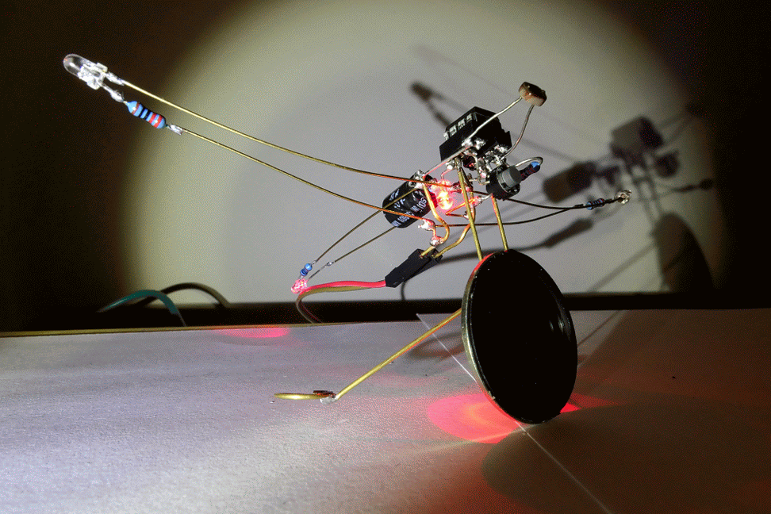

# Tiny Cuicui

*Tiny Cuicui is a little annoying little electronic bird sculpture created for the [Hackaday.IO Circuit Sculpture](https://hackaday.io/contest/162559-circuit-sculpture-contest) contest.*

It is based around the ATtiny85 and can be used built with [PlatformIO](http://www.platformio.org)

See all details on the [project page](https://hackaday.io/project/163045-tiny-cuicui)

